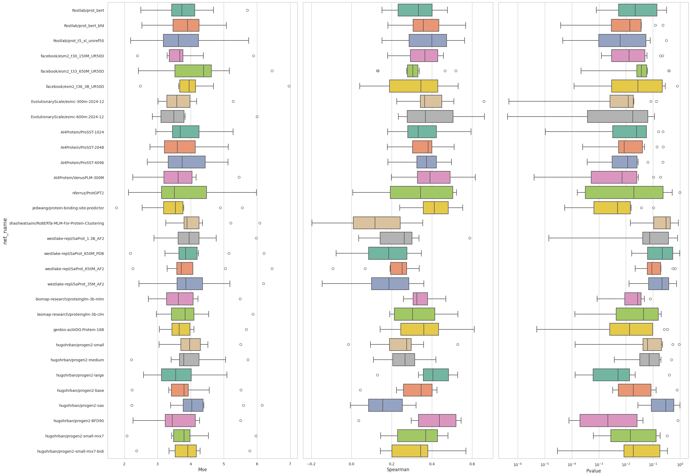
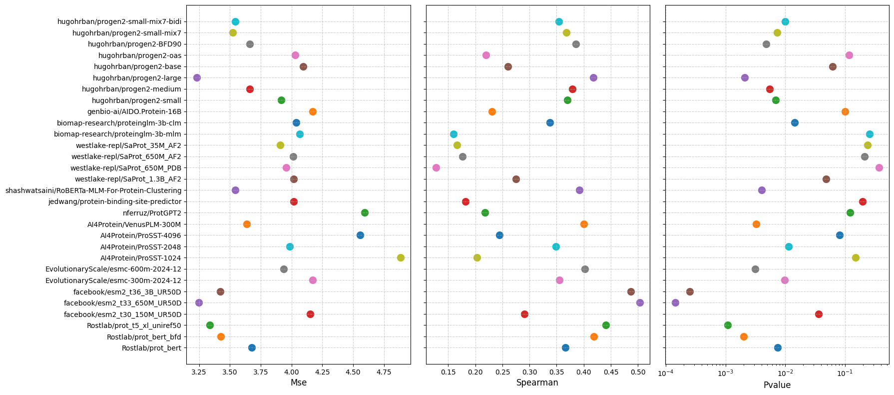

# benchmark_affinity 
用于评估蛋白质语言模型在抗原-抗体亲和力预测任务上的表现的工作流

# 1.算法框架


下游网络：


数据归一化：

首先将数据集的affinity标签转换为N(0,1)分布，再训练模型。

# 2.数据集

- 独立的亲和力数据集:
  用于评估模型在亲和力预测任务上的表现。
- 公开的抗原抗体亲和力数据集:
  用于训练添加下游网络之后的新模型。

# 3.代码说明

* demo01_pipeline.ipynb - 评估蛋白质语言模型在抗原-抗体亲和力预测任务上的表现的完整工作流。在蛋白质语言模型上，添加统一的下游网络来构建抗体亲和力预测模型；首先进行交叉验证来对比多个亲和力预测模型；然后使用训练集训练模型，最终在测试集上评估所有模型的预测亲和力的表现。

# 4.快速使用

代码运行需要python3.12或以上版本

首先进入当前目录:

```powershell
cd benchmark_affinity
```

运行以下命令:

```powershell
conda env create -f environment.yml
conda activate benchmark_affinity
python -m ipykernel install --user --name=python3
```

最后运行 Jupyter:

```powershell
jupyter notebook
```

# 5.模型评估结果

  交叉验证结果
  
  
  测试集测试结果
  

